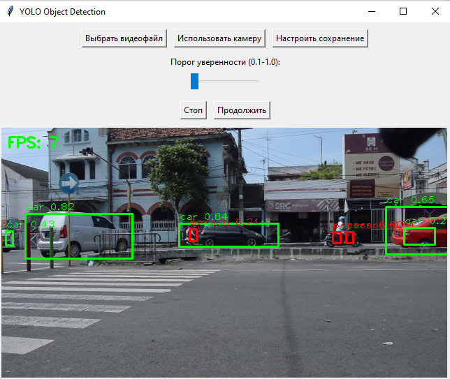

# YOLO Object Detection App

Программа для детекции объектов на видео/камере с использованием YOLOv3-tiny.

###### *По умолчанию используется YOLOv3-tiny для максимальной производительности и работы в реальном времени на среднем CPU. При наличии GPU, ресурсов и в целях повышения точности можно перейти на YOLOv4-tiny или выше.



## 📦 Установка

1. Клонируйте репозиторий:
```bash
git clone https://github.com/navyit/yolo_object_detector.git
cd yolo_object_detector 
```
2. Установите зависимости:
Должна быть установлена версия Python >= 3.8
```bash
pip install -r requirements.txt
```
## 🚀 Запуск

``` bash
python object_detection.py
```
## 🛠 Функционал
Основные возможности:
- Детекция объектов на видеофайле или камере

- Настройка порога уверенности

- Сохранение результатов

- Пауза/продолжение обработки

## 📂 Структура проекта
- yolo/ - Модель YOLO и конфиги

- object_detection.py - Основной скрипт

- tests.py - Модульные тесты

## ❓ Помощь
Если модель не загружается:

- Проверьте наличие файлов в папке yolo/

- Скачайте недостающие файлы:

  * [yolov3-tiny.weights](https://data.pjreddie.com/files/yolov3-tiny.weights)

  * [yolov3-tiny.cfg](https://github.com/pjreddie/darknet/blob/master/cfg/yolov3-tiny.cfg)

  * [coco.names](https://github.com/pjreddie/darknet/blob/master/data/coco.names)

## Для Linux пользователей
Если возникают ошибки с tkinter, выполните:
```bash
sudo apt-get install python3-tk  # Для Debian/Ubuntu
sudo dnf install python3-tkinter  # Для Fedora
```
